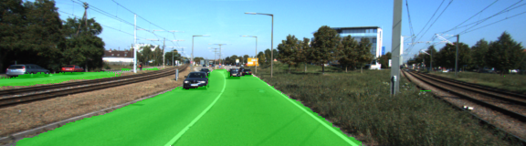
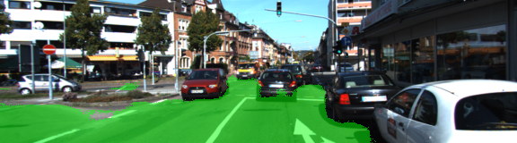
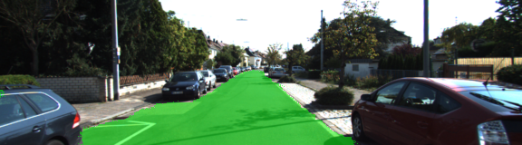
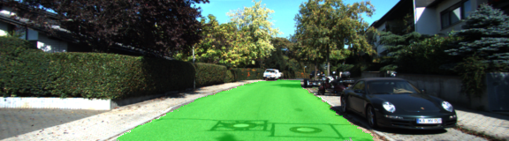

# **Semantic Segmentation**

Project to label the pixels of a road in images using a Fully Convolutional Network (FCN).

Full description of problem and task: [TASK.md](TASK.md)  
Source code: [main.py](main.py), [helper.py](helper.py), [project_tests.py](project_tests.py)

## Example Images of Semantic Segmentation:

